<div align="center">



<br/>

<a href="https://www.linkedin.com/in/marvin-wandati/"></a>
<a href="mailto:wandatimarvin23@gmail.com"></a>


</div>

---

## `$ whoami`

```console
wandati@secops:~$ cat /etc/profile.d/identity.sh

  ROLE      DevSecOps Engineer — secure, observable, production-ready cloud platforms
  BASED     Milan, Italy
  EXP       2+ years across cloud platform engineering and production operations
  CONTEXT   B2B SaaS · sole DevSecOps engineer · AWS-native platform
  REGION    eu-west-1 · 3 isolated environments · fully Terraform-managed
  THESIS    Practical security — controls that reduce risk, survive audits,
            and keep delivery moving.

wandati@secops:~$ _
```

I work across **AWS**, **Kubernetes**, **Terraform**, **CI/CD**, **container hardening**, **software supply-chain security**, **observability**, and **production operations** — and I act as first responder when production pages.

---

## `$ ./report --impact --verified`

> Every number below is from work I shipped and can walk you through.

| | Before | After | What it took |
|---|---:|---:|---|
| **Container image findings** | `1,014` | **`9`** | base image rebuild, layer surgery, dependency pruning |
| **Critical CVEs** | `25` | **`0`** | continuous scanning wired into the merge gate |
| **High CVEs** | `284` | **`7`** | same pipeline, enforced on every build |
| **Production image size** | `2.5 GB+` | **`< 200 MB`** | multi-stage builds, ruthless layer elimination |
| **Long-lived AWS keys in CI** | `100%` | **`0`** | full GitHub Actions → OIDC migration |
| **Avoidable RDS storage cost** | `$1,300+/mo` | **`reclaimed`** | 13.2 TB rebuilt on gp3 under Terraform ownership |

<div align="center">


</div>

---

## `$ systemctl status secure-delivery`

I built the DevSecOps foundation from zero: a **six-gate GitHub Actions pipeline** that caught **4 HIGH-severity CVEs before the first production deployment**. Unsigned images cannot reach production — Cosign verification is mandatory, not advisory.

<div align="center">

</div>

Promotion through **dev → staging → prod** runs on tag-based gates with required approvals, so every production release is **reviewed, signed, and traceable**.

---

## `$ radar --scan --year 2026`

<table>
<tr>
<td width="48%" valign="top">

</td>
<td width="52%" valign="top">

### `[01]` AI & Agentic Security
The attack surface moved. Agents that hold credentials, call tools, and act autonomously need the same rigour we spent a decade building for CI/CD — **identity, least privilege, audit trail, and a kill switch**. OWASP LLM Top 10 as a baseline, MCP server hardening, prompt-injection boundaries, and AI-BOM alongside SBOM.

### `[02]` Software Supply Chain
**Provenance beats trust.** SBOM on every build, Cosign signatures enforced at admission, and dependency review that blocks rather than warns. If you can't prove where an artifact came from, it doesn't ship.

### `[03]` Policy-as-Code & Shift-Left
Security that lives in a PDF is decoration. Controls belong **in the pipeline as code** — scanning gates, admission control, and CIS benchmark checks that fail the build instead of filing a ticket.

### `[04]` Platform Engineering + FinOps
Golden paths so the secure route is the *easy* route. And **cost as a guardrail**, not a quarterly surprise — the same instinct that found $15.6K/year sitting in over-provisioned storage.

</td>
</tr>
</table>

---

## `$ ls -la ~/toolchain`

<table>
<tr>
<td width="52%" valign="top">

**Cloud & Infrastructure**


**Security & Supply Chain**


</td>
<td width="48%" valign="top">

</td>
</tr>
</table>

**CI/CD & Automation**


**Observability & Data**


---

## `$ ls ~/.credentials`

<div align="center">


<br/>


</div>

---

## `$ journalctl --unit platform --since "2025-02"`

<details open>
<summary><b>◢ DevSecOps Engineer · Expandi Group</b> · <code>Feb 2026 — Present</code> — <i>B2B SaaS · sole DevSecOps engineer · AWS-native</i></summary>

<br/>

- **Built the DevSecOps foundation from zero** — a 6-gate GitHub Actions pipeline (SAST, secret scanning, dependency review, image scanning, SBOM, artifact signing) that caught **4 HIGH-severity CVEs before the first production deployment**.
- **Eliminated 100% of long-lived AWS keys from CI/CD** by migrating GitHub Actions to OIDC, and enforced Cosign verification so unsigned images cannot reach production.
- **Led container hardening for a core service** — findings `1,014 → 9`, Critical `25 → 0`, High `284 → 7`, image size `2.5 GB+ → < 200 MB`.
- **Deployed and operate 3 isolated AWS environments** in `eu-west-1` with modular Terraform (App Runner, API Gateway, S3, CloudFront, ECR, RDS, Route 53) — including a **zero-downtime DNS migration** from GoDaddy to Route 53.
- **Own the dev → staging → prod release lifecycle** — promotion through GitHub Actions with tag-based gates and required approvals; every production release is reviewed, signed, and traceable.
- **Established the first production observability baseline** (OpenObserve, Grafana Cloud, CloudWatch, X-Ray, Micrometer, structured JSON logs, WAF telemetry) with alarms on p95/p99 latency, JVM, database and queue health — and act as **first responder for production incidents**.
- **Provisioned a private Terraform-managed OpenSearch platform** for **3.22M company documents (78.3M Lucene docs)** with KMS encryption, VPC-only access, and least-privilege IAM separation.
- **Reclaimed $1,300+/month ($15.6K+/year)** in avoidable RDS storage cost by recreating a 13.2 TB database on gp3 under Terraform ownership, restoring auditable IaC control.
- **Made a previously unqueryable S3 document archive product-ready** — validated and curated **40 GB+** with Athena, then migrated it into RDS.

</details>

<details>
<summary><b>◢ DevOps Engineer · Ryanada Limited</b> · <code>Feb 2025 — Aug 2025</code> — <i>Cloud hosting platform · domains & VPS · Kubernetes operations</i></summary>

<br/>

- **Standardized configuration across 100+ hosting servers** with reusable Ansible playbooks, replacing hours-long manual setup with repeatable provisioning and cutting configuration drift.
- **Replaced customer-reported failures with synthetic detection** — Playwright monitors for customer-facing services, routed through Elasticsearch and ElastAlert to Slack, so operations could intervene *before* incidents became support calls.
- **Operated containerized services across two Kubernetes clusters**, improving stateful workload resilience with Longhorn persistent storage, automated snapshots, and node-failure recovery workflows.
- **Strengthened recovery across both clusters** with Kasten K10 backups to MinIO S3, with schedules and retention aligned to workload criticality.
- **Centralized high-volume platform logs** in the ELK stack, automating alerts for CPU saturation and application latency to accelerate investigation.

</details>

---

## `$ git log --graph --author=Wandati26`

> Most of what I build lives in private company repositories, so this graph
> undercounts by a wide margin. The numbers worth judging me on are in the
> impact table above — and I'm happy to walk through any of them.

<div align="center">
<picture>
  <source media="(prefers-color-scheme: dark)" srcset="https://raw.githubusercontent.com/Wandati26/Wandati26/output/github-snake-dark.svg" />
  <source media="(prefers-color-scheme: light)" srcset="https://raw.githubusercontent.com/Wandati26/Wandati26/output/github-snake.svg" />
  
</picture>
</div>

---

## `$ cat ~/.philosophy`

```console
wandati@secops:~$ cat ~/.philosophy

  01  Security that blocks the build beats security that files a ticket.
  02  If you can't prove where an artifact came from, it doesn't ship.
  03  Observability is not dashboards. It's knowing before the customer does.
  04  Cost is a guardrail, not a quarterly surprise.
  05  The secure path has to be the easy path, or nobody takes it.

wandati@secops:~$ _
```

---

<div align="center">

### `$ ./connect`

<a href="https://www.linkedin.com/in/marvin-wandati/"></a>
<a href="mailto:wandatimarvin23@gmail.com"></a>
<a href="https://github.com/Wandati26"></a>

<br/><br/>

<sub><code>signed · scanned · attested — every artifact, every release</code></sub>

</div>
